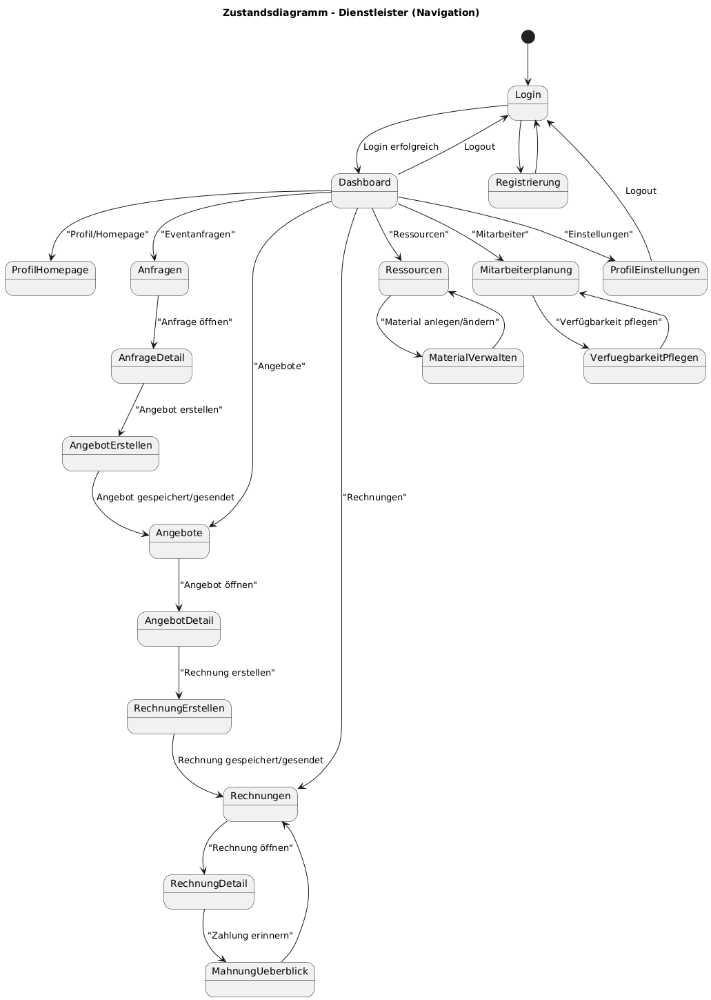

# 1 Fachliche Grundlagen und Anforderungen (Team A)

## 1.1 Produktvision
### 1.1.1 Zielsetzung des Softwareprodukts
Die Zielsetzung des Softwareprodukts ist es, eine Zentrale Platform zur Planung, Organisation, Durchführung und Nachbereitung von Veranstaltungen zu erstellen. Dazu sollen viele verschiedene Tools zusammengelegt werden, wie zum Beispiel verschiedene Messenger, Email, Excel und Ticketsysteme. Also sammelt man alle relevanten Informationen an einem Ort/ auf einer Platform. Das System soll Transparenz über Termine, Aufgaben, Finanzen und Teilnehmer bieten. Dabei soll das Softwareprodukt sowohl für private als auch kommerziele Nutzung dienen. Weitere Anforderungen sind die Endgeräteunabhänigkeit und die Skalierbarkeit des Produktes. Das Produkt bietet eine Kombination aus Eventplanung, Finanzverwaltung und Dienstleisterintegration.
### 1.1.2 Produktname und Begründung
Wir nennen das Softwareprodukt "EventHub". Der Name ist leicht merkbar und simpel, spiegelt den Zweck der Software gut wieder und ist international verständlich. Außerdem ist er nicht zu technisch aber gleichzeitig professionell.

## 1.2 Akteure und Rollen
### 1.2.1 Nicht registrierte/unangemeldete Akteure
Ein nicht angemeldeter Akteuer hat folgende Optionen:
- Registrierung durchführen
- Login durchführen
- öffentliche Event- und Dienstleisterseiten aufrufen
### 1.2.2 Registrierte Akteuere
#### 1.2.2.1 Privatnutzer/Teinehmer
Das sind die Nutzer, die Events beitreten und dran teilnehmen. Sie können:
- sich registrieren/anmelden
- Gruppen beitreten/verlassen
- Notizen, Termine, Umfragen erstellen und dran teilnehmen
- abstimmen & kommentieren
- Einzahlungen vornehmen
- Aufgaben übernehmen
- Medien hochladen
- Kalender synchronisieren
#### 1.2.2.3 Gruppenmitglied
Ein Gruppenmitglied kann:
- Inhalte einer Gruppe lesen
- Notizen erstellen/bearbeiten/löschen
- an Umfragen teilnehmen
- Aufgaben übernehmen
- Einzahlungen vornehmen
- Multimedia hochladen
- Gruppe verlassen

#### 1.2.2.4 Organisator/Gruppenleiter
- Gruppe/Event erstelllen und löschen
- Mitglieder einladen/entfernen/sperren
- Beitrittscode verwalten
- Mindestteilnehmerzahl festlegen
- Mindestbudget festlegen
- Aufgaben zuweisen
- Rückzahlungen veranlassen
- Eventseite verwalten
- Übersicht über Finanzen
- Moderationsmöglichkeiten

#### 1.2.2.5 Insitutionsadministrator
Das können zum Beispiel Lehrer oder Firmenverantwortliche sein:
- meherer Events verwalten
- Rollen und Berechtigungen vergeben
- Benutzerkonten innerhalb der Institution verwalten
- Übersicht über alle Veranstaltungen der Organisation
- Nutzungslimits überwachen
- Abrechnungen/Events archivieren

#### 1.2.2.6 Instituitionsmitglied
- meist nur leserechte
- Teilnahme an Events
- Aufgaben ausführen

#### 1.2.2.7 Veranstaltungs-Dienstleister
- eigenes Profil/Homepage verwalten
- Eventanfragen empfangen
- Angebote erstellen
- Rechnungen generieren
- Ressourcen planen
- Material und Personal verwalten
- Budgets kalkulieren
- durch Kunden bewerten lassen

#### 1.2.2.8 Mitarbeiter eines Dienstleisters
- persönliche Verfügbarkeit pflegen
- Einsätze/Arbeitspläne einsehen
- Benachrichtigungen bei Zuweisung erhalten
- Qualifikationen verwalten

#### 1.2.2.9 Kunde/Veranstalter (extern)
- Event anfragen
- Budget angeben
- Angebote erhalten
- Angebote annehmen und ablehnen
- Rechnungen bezahlen
- Dienstleister bewerten
### 1.2.3 Sekundäre Akteuere

#### 1.2.3.1 Externe Systeme
- Kalenderdienste (z.B Outlook, Google Kalender)
- Kommunikationsdienste (E-Mail, SMS, Messenger)
- Zahlungsdienste
- Ticketing-Systeme
- Datenaustausch über APIs

#### 1.2.3.2 Systemadministator
- Benutzer sperren/verwalten
- Systemkonfiguration
- Backups/Wartung

#### 

## 1.3 Glossar der Fachdomäne
### 1.3.1 Begriffsdefinitionen

# 2 Funktionale Anforderungen

## 2.1 Funktionale Gruppen Übersicht

- FG1 Account und Authentifizierung
- FG2 Profil und Einstellungen
- FG3 Gruppen- und Eventmanagement
- FG4 Notizen und Umfragen
- FG5 Finanzen
- FG6 Aufgabenmanagement
- FG7 Medien und Dokumentation
- FG8 Rollen- und Rechtesystem
- FG9 Öffentliche Eventseite und QR-Code
- FG10 Integration und Benachrichtigungen
- FG11 Dienstleister und Anfragen
- FG12 Angebote, Rechnungen und Mahnungen
- FG13 Ressourcenplanung

## 2.2 FG1 Account und Authentifizierung

| Name/ID | In meiner Rolle als... | ...möchte ich... | ..., so dass... | Akzeptiert, wenn... | Priorität |
|----------|----------------------|-----------------|----------------|--------------------|-----------|
| US-01 Registrierung | Gast | mich registrieren | ich das System nutzen kann | Pflichtfelder sind ausgefüllt und Account wird erstellt | Muss |
| US-02 Login | Benutzer | mich anmelden | ich Zugriff auf meine Daten habe | korrekte Zugangsdaten erlauben Anmeldung | Muss |
| US-03 Logout | Benutzer | mich abmelden | niemand mein Konto missbraucht | Sitzung wird beendet | Muss |
| US-04 Passwort zurücksetzen | Benutzer | mein Passwort zurücksetzen | ich wieder Zugriff bekomme | Reset-Link oder Code ermöglicht neues Passwort | Muss |
| US-05 2FA aktivieren | Benutzer | Zwei-Faktor-Authentifizierung nutzen | mein Account sicherer ist | zusätzlicher Faktor wird beim Login geprüft | Sollte |

## 2.3 FG2 Profil und Einstellungen

| Name/ID | In meiner Rolle als... | ...möchte ich... | ..., so dass... | Akzeptiert, wenn... | Priorität |
|----------|----------------------|-----------------|----------------|--------------------|-----------|
| US-06 Profil anzeigen | Benutzer | mein Profil sehen | ich meine Daten prüfen kann | gespeicherte Daten werden angezeigt | Muss |
| US-07 Profil bearbeiten | Benutzer | meine Daten ändern | sie aktuell bleiben | Änderungen werden gespeichert | Muss |
| US-08 Kommunikationsweg wählen | Benutzer | bevorzugte Benachrichtigungen einstellen | ich passende Nachrichten erhalte | gewählter Kanal wird gespeichert | Sollte |
| US-09 Sprache wählen | Benutzer | die Sprache ändern | ich die Oberfläche verstehe | UI-Texte werden angepasst | Sollte |

## 2.4 FG3 Gruppen- und Eventmanagement

| Name/ID | In meiner Rolle als... | ...möchte ich... | ..., so dass... | Akzeptiert, wenn... | Priorität |
|----------|----------------------|-----------------|----------------|--------------------|-----------|
| US-10 Gruppe erstellen | Organisator | eine Gruppe anlegen | ich ein Event planen kann | Name und Beschreibung werden gespeichert | Muss |
| US-11 Gruppe löschen | Organisator | meine Gruppe löschen | alte Events entfernt werden | Gruppe wird archiviert oder gelöscht | Muss |
| US-12 Gruppe beitreten | Benutzer | einer Gruppe beitreten | ich teilnehmen kann | gültiger Beitrittscode erlaubt Beitritt | Muss |
| US-13 Gruppe verlassen | Benutzer | eine Gruppe verlassen | ich nicht mehr beteiligt bin | Mitgliedschaft endet | Muss |
| US-14 Mitglieder anzeigen | Benutzer | alle Mitglieder sehen | ich Überblick habe | Liste wird angezeigt | Muss |
| US-15 Mitglieder verwalten | Organisator | Mitglieder entfernen oder sperren | Regeln durchgesetzt werden | Zugriff wird entzogen | Muss |
| US-16 Mindestteilnehmer festlegen | Organisator | eine Mindestzahl definieren | Event nur bei genug Teilnehmern stattfindet | Status wird automatisch geprüft | Sollte |

## 2.5 FG4 Notizen und Umfragen

| Name/ID | In meiner Rolle als... | ...möchte ich... | ..., so dass... | Akzeptiert, wenn... | Priorität |
|----------|----------------------|-----------------|----------------|--------------------|-----------|
| US-17 Notiz erstellen | Benutzer | eine Notiz anlegen | Infos dokumentiert sind | Notiz erscheint in der Liste | Muss |
| US-18 Notiz bearbeiten | Benutzer | Notizen ändern | Fehler korrigiert werden | Änderungen werden gespeichert | Muss |
| US-19 Notiz löschen | Benutzer | Notizen entfernen | irrelevante Infos verschwinden | Notiz wird entfernt | Muss |
| US-20 Notizen filtern | Benutzer | nach Typ filtern | ich schneller finde, was ich suche | Filter zeigt passende Einträge | Sollte |
| US-21 Termin erfassen | Benutzer | Termine mit Datum und Ort speichern | alle informiert sind | Termin enthält strukturierte Felder | Muss |
| US-22 Umfrage erstellen | Benutzer | eine Umfrage anlegen | Entscheidungen getroffen werden | Antwortoptionen frei wählbar | Muss |
| US-23 Abstimmen | Benutzer | an Umfragen teilnehmen | meine Meinung zählt | Stimme wird gezählt | Muss |
| US-24 Ergebnis anzeigen | Benutzer | Ergebnisse sehen | Transparenz besteht | Stimmenverteilung wird angezeigt | Muss |

## 2.6 FG5 Finanzen

| Name/ID | In meiner Rolle als... | ...möchte ich... | ..., so dass... | Akzeptiert, wenn... | Priorität |
|----------|----------------------|-----------------|----------------|--------------------|-----------|
| US-25 Einzahlung tätigen | Benutzer | Geld einzahlen | Event finanziert wird | Betrag wird gespeichert | Muss |
| US-26 Zahlungsstand anzeigen | Benutzer | Gesamtbetrag sehen | ich Überblick habe | eingegangenes Geld und Zielsumme werden angezeigt | Muss |
| US-27 Ausgabe erfassen | Benutzer | Ausgaben dokumentieren | Kosten transparent sind | Betrag und Beschreibung werden gespeichert | Muss |
| US-28 Kassenübersicht | Organisator | alle Einnahmen und Ausgaben sehen | ich abrechnen kann | Summen werden korrekt berechnet | Muss |
| US-29 Rückzahlung auslösen | Organisator | Rückzahlungen durchführen | Guthaben ausgeglichen wird | Rückzahlung wird dokumentiert | Sollte |

## 2.7 FG6 Aufgabenmanagement

| Name/ID | In meiner Rolle als... | ...möchte ich... | ..., so dass... | Akzeptiert, wenn... | Priorität |
|----------|----------------------|-----------------|----------------|--------------------|-----------|
| US-30 Aufgabe erstellen | Organisator | Aufgaben anlegen | To-dos geplant sind | Aufgabe erscheint in Liste | Muss |
| US-31 Aufgabe übernehmen | Benutzer | Aufgaben übernehmen | Zuständigkeit klar ist | Aufgabe wird mir zugeordnet | Muss |
| US-32 Aufgabe abschließen | Benutzer | Aufgaben als erledigt markieren | Fortschritt sichtbar ist | Status ändert sich auf erledigt | Muss |
| US-33 Erinnerung senden | System | an offene Aufgaben erinnern | nichts vergessen wird | Benachrichtigung wird automatisch gesendet | Sollte |

## 2.8 FG7 Medien und Dokumentation

| Name/ID | In meiner Rolle als... | ...möchte ich... | ..., so dass... | Akzeptiert, wenn... | Priorität |
|----------|----------------------|-----------------|----------------|--------------------|-----------|
| US-34 Medien hochladen | Benutzer | Fotos oder Videos hochladen | das Event dokumentiert ist | Dateien werden gespeichert und angezeigt | Sollte |
| US-35 Kommentare schreiben | Benutzer | Bewertungen oder Kommentare hinterlassen | Erfahrungen geteilt werden | Text wird gespeichert | Könnte |

## 2.9 FG8 Rollen- und Rechtesystem

| Name/ID | In meiner Rolle als... | ...möchte ich... | ..., so dass... | Akzeptiert, wenn... | Priorität |
|----------|----------------------|-----------------|----------------|--------------------|-----------|
| US-36 Rollen vergeben | Institutionsadmin | Rollen zuweisen | Rechte gesteuert werden | Berechtigungen werden gespeichert | Muss |
| US-37 Leserechte einschränken | Institutionsmitglied | nur lesen können | Regeln eingehalten werden | Schreibfunktionen deaktiviert | Muss |
| US-38 Lizenzlimit prüfen | Institutionsadmin | Events begrenzen | Community-Regeln gelten | mehr als drei Events werden verhindert | Sollte |

## 2.10 FG9 Öffentliche Eventseite und QR-Code

| Name/ID | In meiner Rolle als... | ...möchte ich... | ..., so dass... | Akzeptiert, wenn... | Priorität |
|----------|----------------------|-----------------|----------------|--------------------|-----------|
| US-39 Eventseite anzeigen | Organisator | eine öffentliche Seite haben | ich das Event bewerben kann | feste URL ist erreichbar | Sollte |
| US-40 QR-Code generieren | Benutzer | einen QR-Code erhalten | ich den Link schnell teilen kann | Code wird korrekt erzeugt | Sollte |

## 2.11 FG10 Integration und Benachrichtigungen

| Name/ID | In meiner Rolle als... | ...möchte ich... | ..., so dass... | Akzeptiert, wenn... | Priorität |
|----------|----------------------|-----------------|----------------|--------------------|-----------|
| US-41 Kalender synchronisieren | Benutzer | Termine synchronisieren | sie automatisch im Kalender erscheinen | Synchronisation funktioniert | Könnte |
| US-42 Benachrichtigungen senden | System | Nachrichten versenden | Nutzer informiert bleiben | Versand über gewählten Kanal erfolgt | Sollte |
| US-42a Sprachassistent verbinden | Benutzer | einen digitalen Sprachassistenten koppeln | ich per Sprache auf meine Events zugreifen kann | Verbindung wird autorisiert und Konto ist verknüpft | Könnte |
| US-42b Termine per Sprache abfragen | Benutzer | meine nächsten Termine per Sprachbefehl abrufen | ich Informationen freihändig erhalten kann | Assistent gibt korrekte Termine aus | Könnte |
| US-42c Aktion per Sprache ausführen | Benutzer | einfache Aktionen wie Aufgaben abhaken oder Einzahlungen bestätigen per Sprache ausführen | ich schnell reagieren kann ohne die App zu öffnen | Aktion wird korrekt ausgeführt und im System gespeichert | Könnte |

## 2.12 FG11 Dienstleister und Anfragen

| Name/ID | In meiner Rolle als... | ...möchte ich... | ..., so dass... | Akzeptiert, wenn... | Priorität |
|----------|----------------------|-----------------|----------------|--------------------|-----------|
| US-43 Anfrage stellen | Kunde | ein Event anfragen | ich ein Angebot erhalte | Formular speichert alle Pflichtdaten | Muss |
| US-44 Angebot erstellen | Dienstleister | ein Angebot generieren | ich Kunden informieren kann | Angebotsdokument wird erstellt | Muss |
| US-45 Rechnung erstellen | Dienstleister | eine Rechnung erzeugen | ich abrechnen kann | Rechnung enthält alle Pflichtangaben | Muss |
| US-46 Zahlung erinnern | System | an offene Rechnungen erinnern | Zahlungen rechtzeitig eingehen | Erinnerung wird automatisch versendet | Sollte |

## 2.13 FG12 Ressourcenplanung

| Name/ID | In meiner Rolle als... | ...möchte ich... | ..., so dass... | Akzeptiert, wenn... | Priorität |
|----------|----------------------|-----------------|----------------|--------------------|-----------|
| US-47 Material verwalten | Dienstleister | Material anlegen oder ändern | Bestand aktuell bleibt | Materialdaten werden gespeichert | Muss |
| US-48 Material buchen | Dienstleister | Material einem Event zuordnen | Doppelbuchungen vermieden werden | Material ist im Zeitraum gesperrt | Muss |
| US-49 Mitarbeiter verwalten | Dienstleister | Mitarbeiter planen | Personal verfügbar ist | Einsatzplan berücksichtigt Verfügbarkeit | Muss |
| US-50 Wartungshinweis | System | Wartungen anzeigen | Geräte sicher bleiben | Hinweis erscheint bei fälligem Zyklus | Sollte |

# 3 Nicht-funktionale Anforderungen (ISO 25010)

## 3.1 Performance Efficiency
Die Plattform soll gemäß der Aufgabenstellung auch bei sehr vielen gleichzeitigen Benutzern eine hohe Leistungsfähigkeit aufweisen. Das System muss skalierbar sein und darf auch bei paralleler Nutzung mehrerer Gruppen und Events keine spürbaren Verzögerungen zeigen. Aktionen sollen innerhalb von maximal zwei Sekunden verarbeitet werden und der Seitenaufbau soll auch bei normaler Netzwerklatenz nur wenige Sekunden dauern. Das System soll mehrere tausende, gleichzeitige Benutzer unterstützen und bei steigender Last einfach weiter skalierbar sein z.B durch weitere Serverinstanzen.

Zusätzlich werden zur Sicherstellung einer stabilen Performance sinnvolle ergänzende Maßnahmen definiert. Ressourcenintensive Prozesse wie Datei-Uploads oder größere Berechnungen sollen asynchron im Hintergrund ausgeführt werden, damit die Benutzeroberfläche weiterhin reaktionsfähig bleibt. Der Ressourcenverbrauch von CPU, Arbeitsspeicher und Datenbank soll überwacht und regelmäßig optimiert werden, um auch bei wachsendem Datenbestand eine gleichbleibende Leistung zu gewährleisten.

Damit werden zunächst die explizit geforderten Punkte aus der Aufgabenstellung (Skalierbarkeit und hohe Performance bei vielen Nutzern) umgesetzt und anschließend technisch sinnvolle Ergänzungen zur Absicherung der Systemqualität vorgenommen.

## 3.2 Compatibility
Das System soll auf unterschiedlichen Endgeräten und Softwareumgebungen nutzbar sein. Gemäß der Aufgabenstellung muss die Anwendung sowohl im Webbrowser als auch auf mobilen Endgeräten lauffähig sein und funktional konsistent sein. Alle wesentlichen Funktionen der Webversion sollen somit auch in der mobilen Anwendung in gleicher oder gleichwertiger Form zur Verfügung stehen.

Die Webanwendung soll in aktuellen Versionen der gängigen Browser Google Chrome, Microsoft Edge, Mozilla Firefox und Safari ohne zusätzliche Plugins oder Erweiterungen nutzbar sein. Für mobile Endgeräte soll eine Unterstützung der Betriebssysteme Android und iOS gewährleistet werden.

Darüber hinaus soll das System die Integration externer Dienste ermöglichen. Es sollen Kalenderdienste wie Google Calendar, Outlook und iCal angebunden werden können, sodass Termine automatisch synchronisiert werden. Weitere Schnittstellen, beispielsweise zu Zahlungs- oder Ticketingsystemen, sollen über REST‑APIs realisiert werden.

Ergänzend werden folgende technische Maßnahmen geplant, um eine hohe Geräteunabhängigkeit sicherzustellen: Die Benutzeroberfläche soll responsiv gestaltet sein und sich automatisch an unterschiedliche Bildschirmgrößen und Auflösungen anpassen. Damit wird die explizit geforderte Endgeräteunabhängigkeit umgesetzt und durch zusätzliche Maßnahmen zur praktischen Nutzbarkeit abgesichert.

## 3.3 Usability (Gebrauchstauglichkeit)
Die Anwendung soll gemäß der Aufgabenstellung ohne lange Einarbeitung nutzbar sein. Neue Nutzer sollen grundlegende Funktionen wie das Erstellen oder Beitreten von Gruppen, das Anlegen von Notizen sowie das Verwalten von Aufgaben und Zahlungen intuitiv bedienen können, ohne zuvor eine Schulung oder umfangreiche Anleitung zu benötigen.

Die Benutzeroberfläche soll klar strukturiert und konsistent aufgebaut sein. Navigationselemente, Bezeichnungen und Strukturen sollen über alle Bereiche der Anwendung hinweg einheitlich verwendet werden, damit sich Nutzer schnell orientieren können. Zentrale Funktionen sollen mit wenigen Interaktionen erreichbar sein, sodass typische Aufgaben ohne nervige Zwischenschritte ausgeführt werden können.

Systemmeldungen und Fehlermeldungen sollen verständlich formuliert sein und dem Nutzer konkrete Hinweise zur Behebung von Problemen geben. Unterschiedliche Inhalte, wie beispielsweise Notiztypen oder Statusinformationen, sollen visuell eindeutig unterscheidbar dargestellt werden, etwa durch Farben oder Symbole.

Zusätzlich werden sinnvolle ergänzende Maßnahmen zur Verbesserung der Gebrauchstauglichkeit berücksichtigt. Die Oberfläche soll responsiv gestaltet sein, ausreichend große Bedienelemente besitzen und auch auf mobilen Geräten gut lesbar und bedienbar bleiben. Damit wird die explizit geforderte einfache Nutzbarkeit umgesetzt und durch weitere Maßnahmen zur praktischen Benutzerfreundlichkeit ergänzt.

## 3.4 Reliability (Zuverlässigkeit)
Das System soll zuverlässig betrieben werden können und die zentralen Funktionen der Plattform dauerhaft bereitstellen. Da über die Anwendung unter anderem organisatorische Informationen und Finanzdaten (Einzahlungen und Ausgaben) verwaltet werden, muss eine konsistente Speicherung dieser Daten gewährleistet sein, sodass keine Daten durch technische Störungen verloren gehen oder in einen widersprüchlichen Zustand geraten.

Zur Konkretisierung werden folgende Qualitätsziele festgelegt: Änderungen an relevanten Daten (z. B. Zahlungen, Ausgaben, Aufgabenstatus) sollen dauerhaft und konsistent gespeichert werden. Bei temporären Netzwerkproblemen oder kurzfristigen Serverstörungen sollen Benutzeraktionen nicht zu unvollständigen oder doppelten Einträgen führen. Außerdem sollen regelmäßig automatische Datensicherungen durchgeführt werden, sodass eine Wiederherstellung nach Systemausfällen möglich ist.

Ergänzend werden sinnvolle technische Maßnahmen definiert, um die Zuverlässigkeit praktisch abzusichern. Fehlerzustände sollen protokolliert werden (Logging), und kritische Systemzustände sollen überwacht werden (Monitoring), um Ausfälle frühzeitig zu erkennen. Für zentrale Prozesse sollen geeignete Mechanismen vorgesehen werden, die eine sichere Verarbeitung auch bei hoher Last unterstützen.

## 3.5 Security (Sicherheit)
Die Aufgabenstellung legt einen besonderen Fokus auf Sicherheitsanforderungen. Die Datenkommunikation zwischen Client und Server muss verschlüsselt erfolgen, damit Inhalte nicht von Unbefugten abgefangen werden können. Passwörter dürfen nicht im Klartext gespeichert werden und müssen in der Datenbank ausschließlich in gehashter und gesalzener Form vorliegen. Zusätzlich sollen Nutzer zu starken Passwörtern ermutigt werden und es soll eine Zwei-Faktor-Authentifizierung, beispielsweise per SMS oder vergleichbar, unterstützt werden.

Weiterhin ist aufgrund des Rollen- und Rechtesystems sicherzustellen, dass Benutzer nur auf diejenigen Gruppen- und Eventdaten zugreifen können, für die sie berechtigt sind. Insbesondere müssen administrative Aktionen wie das Entfernen oder Sperren von Mitgliedern auf Organisatoren bzw. Institutionsadministratoren beschränkt sein.

Ergänzend werden technische Schutzmaßnahmen festgelegt, die in modernen Web- und App-Systemen üblich sind. Dazu zählen der Schutz vor typischen Angriffen wie SQL-Injection, Cross-Site Scripting (XSS) und Cross-Site Request Forgery (CSRF) sowie sichere Sitzungsverwaltung (z. B. Timeout bei Inaktivität). Sicherheitsrelevante Ereignisse wie fehlgeschlagene Loginversuche oder Änderungen sicherheitskritischer Einstellungen sollen protokolliert werden.

## 3.6 Maintainability (Wartbarkeit)
Für eine langfristige Nutzung und Weiterentwicklung soll die Plattform wartbar und gut erweiterbar sein. Gemäß der Aufgabenstellung wird ein Client-Server-System umgesetzt, das auf mobilen Endgeräten und im Webbrowser verfügbar ist. Daraus ergibt sich eine klare Trennung zwischen Client, Server und Datenhaltung, sodass Änderungen an einzelnen Komponenten möglichst isoliert vorgenommen werden können.

Zur Konkretisierung werden folgende Qualitätsziele festgelegt: Schnittstellen zwischen den Systemkomponenten sollen klar definiert und dokumentiert sein. Insbesondere ist eine dokumentierte REST-API bereitzustellen, die die Kommunikation zwischen Client und Server nachvollziehbar beschreibt. Die Struktur des Systems soll so gestaltet sein, dass neue Funktionen (z. B. zusätzliche Integrationen oder neue Notiztypen) ohne grundlegende Umstrukturierung ergänzt werden können.

Ergänzend werden Maßnahmen vorgesehen, die Wartbarkeit praktisch unterstützen. Dazu gehören ein konsistenter Code-Stil, eine nachvollziehbare Struktur der Komponenten sowie die Möglichkeit, zentrale Funktionen automatisiert zu testen. Konfigurationswerte (z. B. Rollenrechte oder Systemparameter) sollen soweit sinnvoll ohne Codeänderungen anpassbar sein.

## 3.7 Portability (Übertragbarkeit)
Das System soll auf aktuellen Plattformen betrieben werden können und nicht von spezieller Hardware abhängig sein. Da die Anwendung sowohl im Webbrowser als auch auf mobilen Endgeräten genutzt wird, soll die Lösung auf den gängigen Betriebssystemen lauffähig sein. Dazu gehören insbesondere Android und iOS für mobile Geräte sowie aktuelle Desktop-Umgebungen für die Webnutzung.

Zur Konkretisierung wird festgelegt, dass die Serverkomponenten auf unterschiedlichen Serverumgebungen betrieben werden können sollen. Das Deployment soll standardisiert möglich sein, sodass ein Umzug zwischen unterschiedlichen Umgebungen (z. B. verschiedene Hosting-Anbieter) ohne große Anpassungen realisierbar bleibt.

Ergänzend werden sinnvolle technische Maßnahmen berücksichtigt, um die Übertragbarkeit zu erhöhen. Dazu zählen standardisierte Deploymentverfahren (z. B. Containerisierung) sowie der Export und Import von Daten in gängigen Formaten, sofern dies für administrative oder datenschutzbezogene Zwecke erforderlich ist.

## 3.8 Datenschutz (nicht aus der ISO)
Neben den ISO-Qualitätsmerkmalen sind in der Aufgabenstellung explizite Anforderungen an Datenschutz und Vertraulichkeit genannt. Nutzerdaten müssen gemäß Datenschutzgrundverordnung (DSGVO) behandelt werden, und die Datenschutzrichtlinie muss von den Nutzern bestätigt werden, bevor die Software vollständig genutzt werden kann. Private Informationen, insbesondere Kontaktinformationen und ausgetauschte Nachrichten, dürfen nicht in falsche Hände geraten. Die Aufgabenstellung fordert daher eine verschlüsselte Speicherung und einen verschlüsselten Austausch sensibler Daten; darüber hinaus wird ein Ende-zu-Ende-Verschlüsselungssystem als mögliche Lösung genannt.

Zur Konkretisierung werden folgende Anforderungen festgelegt: Es soll nur die für den Betrieb notwendige Menge personenbezogener Daten gespeichert werden (Datenminimierung). Nutzer sollen ihre eigenen Daten einsehen können und es soll ein Verfahren vorgesehen werden, um personenbezogene Daten auf Anfrage zu löschen. Der Zugriff auf personenbezogene Daten muss durch geeignete Berechtigungen geschützt werden.

Ergänzend werden sinnvolle Maßnahmen vorgesehen, um Datenschutzanforderungen praktisch umzusetzen. Dazu gehören ein nachvollziehbares Lösch- und Aufbewahrungskonzept für Daten, sowie eine sichere Protokollierung, ohne dabei vertrauliche Inhalte im Klartext zu speichern.

# 4 Graphische Benutzungsschnittstelle

## 4.1 Designprinzipien und UX-Grundlagen

### 4.1.1 Zielsetzung der Benutzeroberfläche
Die Benutzeroberfläche von EventHub soll eine einfache und intuitive Bedienung der Plattform ermöglichen. Nutzer sollen typische Aufgaben wie Gruppen beitreten, Events verwalten, Aufgaben bearbeiten oder Zahlungen durchführen ohne Schulung ausführen können. Die Oberfläche ist daher klar strukturiert, reduziert gestaltet und auf die wesentlichen Funktionen fokussiert.

### 4.1.2 Konsistenz und Navigationskonzept
Alle Bereiche der Anwendung verwenden ein einheitliches Layout und wiederkehrende Navigationselemente. Gleichartige Funktionen sind an denselben Positionen erreichbar, sodass sich Nutzer schnell orientieren können. Zentrale Aktionen sind direkt sichtbar und nicht in tiefen Menüstrukturen versteckt. Häufig genutzte Funktionen sind mit maximal zwei bis drei Interaktionen erreichbar.

### 4.1.3 Rollenbasierte Darstellung
Die Oberfläche ist rollenabhängig gestaltet. Benutzer sehen ausschließlich Funktionen, für die sie berechtigt sind. Teilnehmer erhalten eine vereinfachte Ansicht mit Fokus auf Teilnahme und Interaktion, während Organisatoren und Institutionsadministratoren zusätzliche Verwaltungsfunktionen erhalten. Dadurch wird die Komplexität reduziert und Fehlbedienung vermieden.

### 4.1.4 Responsives Design und Geräteunabhängigkeit
Die Anwendung ist responsiv gestaltet und passt sich automatisch an unterschiedliche Bildschirmgrößen und Endgeräte an. Die Webversion ist für Desktop-Browser optimiert, während mobile Endgeräte eine vereinfachte Navigation und größere Bedienelemente erhalten. Alle wesentlichen Funktionen stehen auf beiden Plattformen in gleichwertiger Form zur Verfügung.

### 4.1.5 Fehlervermeidung und Systemfeedback
Pflichtfelder werden eindeutig gekennzeichnet und Eingaben vor dem Speichern validiert. Kritische Aktionen wie Löschen oder Rückzahlungen werden durch Bestätigungsdialoge abgesichert. Das System informiert Nutzer jederzeit über den aktuellen Status, beispielsweise durch Ladeanzeigen, Erfolgsmeldungen oder verständliche Fehlermeldungen. Dadurch bleibt das Systemverhalten nachvollziehbar und transparent.

### 4.1.6 Barrierearme Bedienbarkeit
Texte sind gut lesbar gestaltet und Bedienelemente ausreichend groß dimensioniert, sodass die Anwendung auch auf mobilen Geräten oder Touchscreens komfortabel nutzbar ist. Kontraste und klare Beschriftungen unterstützen eine schnelle Erfassbarkeit der Inhalte.

## 4.2 Navigationsmodelle
### 4.2.1 Zustandsdiagramm – Privatnutzer

### 4.2.2 Zustandsdiagramm – Organisator

### 4.2.3 Zustandsdiagramm – Dienstleister

## 4.3 Webbrowser-Mockups
### 4.3.1 Login & Registrierung
Promt: "Erstelle ein wireframe-ui mockup einer desktop-website mit dem Namen "EventHub". Grauskala, keine Designelemente, nur einfache Rechtecke und Text-Label.

Layout:
desktop browser window {
zentrierter content-bereich ohne sidebar,

oben logo und schriftzug "EventHub",

darunter rechteckige login-box mit title "Login",

in der box mehrere rechteckige eingabefelder:

E-Mail

Passwort

darunter button "Login",

darunter text-links:

"Registrieren"

"Passwort vergessen",

 checkbox "Angemeldet bleiben",

 kleiner hinweisbereich "2-Faktor-Authentifizierung Code",

unter der login-box eine zweite kleinere box oder link "Anmelden"
}

Stil: flach, minimal, nur rechtecke und platzhaltertext, kein realistisches UI-design, kein schatten, keine farben, nur wireframe."
### 4.3.2 Dashboard
Prompt: "Erstelle ein wireframe-ui mockup einer desktop-website mit dem Namen "EventHub". Grauskala, keine Designelemente, nur einfache Rechtecke und Text-Label.

Layout:
desktop browser window {
top header bar { "EventHub" Schriftzug und Logo links und Navigation mit "Dashboard", "Gruppen", "Aufgaben", "Profil" rechts }
sidebar navigation on the left { "Dashboard" (active), "Gruppen", "Aufgaben", "Finanzen", "Profil" }
mittiger Content-Bereich rechts neben der Sidebar {
title: "Dashboard",

darunter mehrere übersichts-karten in einem grid-layout:

karte "Meine Gruppen" -> liste von 3 rechteckigen listen-objekten mit Gruppennamen

karte "Nächste Termine" -> liste von 3 rechteckigen listen-objekten mit Datum + Titel

karte "Offene Aufgaben" -> liste von 3 rechteckigen listen-objekten mit Aufgabenname + Status

karte "Benachrichtigungen" -> liste von 2-3 rechteckigen meldungen

oben rechts ein button "+ Gruppe erstellen"
}
}

Stil: flach, minimal, nur rechtecke und platzhaltertext, kein realistisches UI-design, kein schatten, keine farben, nur wireframe."
### 4.3.3 Gruppenübersicht
Promt: "Erstelle ein wireframe-ui mockup einer desktop-website mit dem Namen "EventHub". Grauskala, keine Designelemente, nur einfache Rechtecke und Text-Label.

Layout:
desktop browser window {
top header bar { "EventHub" Schriftzug und Logo links und Navigation mit "Dashboard", "Gruppen", "Aufgaben", "Profil" rechts }
sidebar navigation on the left { "Gruppen" (active), "Dashboard", "Aufgaben", "Finanzen", "Profil" }
mittiger Content-Bereich rechts neben der Sidebar {
title: "Gruppenübersicht",

oben eine suchleiste "Gruppe suchen" und ein eingabefeld "Beitrittscode eingeben" mit button "Beitreten",

darunter sektion "Meine Gruppen" → liste von 4 rechteckigen listen-objekten mit:

Gruppenname

kurze Beschreibung

1x Button "Öffnen"

1x Button "Verlassen",

oben rechts ein button "+ Gruppe erstellen"
}
}

Stil: flach, minimal, nur rechtecke und platzhaltertext, kein realistisches UI-design, kein schatten, keine farben, nur wireframe."
### 4.3.4 Event-Detailseite
Promt: "Erstelle ein wireframe-ui mockup einer desktop-website mit dem Namen "EventHub". Grauskala, keine Designelemente, nur einfache Rechtecke und Text-Label. Layout: desktop browser window { top header bar { "Eventhub" Schriftzug und logo links und navigation mit "Dashboard", Gruppen", "Aufgaben", "Profil" rechts} sidebar navigation on the left {"Übersicht "(active), "Notizen/Umfragen", "Aufgaben", "Finanzen", "Medien", "Mitglieder"}Mittiger Content-Bereich recht neben der sidebar {title: "Event-Detail", darunter eine Zeile mit "Event-Titel" und "Ort,Datum", darunter action buttons: "+Notiz erstellen", "+Aufgabe hinzufügen", "Mitglieder verwalten", darunter Sektion "Übersicht" -> untergeordnet liste von 3 rechteckigen listen-objekten mit "Notizen/Aufgaben" als Titel und "Beschreibung der Notiz/Aufgabe" als untertext"}"
### 4.3.5 Finanzen
Prompt:"
Erstelle ein wireframe-ui mockup einer desktop-website mit dem Namen "EventHub". Grauskala, keine Designelemente, nur einfache Rechtecke und Text-Label.

Layout:
desktop browser window {
top header bar { "EventHub" Schriftzug und Logo links und Navigation mit "Dashboard", "Gruppen", "Aufgaben", "Profil" rechts }
sidebar navigation on the left { "Übersicht", "Notizen/Umfragen", "Aufgaben", "Finanzen" (active), "Medien", "Mitglieder" }
mittiger Content-Bereich rechts neben der Sidebar {
title: "Finanzen",

oben budget-übersicht als rechteckige info-boxen:

"Budget-Ziel"

"Aktueller Stand"

"Restbetrag"

darunter action buttons: "+ Einzahlung hinzufügen", "+ Ausgabe erfassen", "Rückzahlung auslösen",

darunter tabelle mit mehreren rechteckigen listen-objekten:

Datum

Typ (Einzahlung/Ausgabe)

Beschreibung

Betrag

Buttons "Bearbeiten", "Löschen"

optional einfache fortschrittsleiste als rechteckiger balken für Budgetfortschritt
}
}

Stil: flach, minimal, nur rechtecke und platzhaltertext, kein realistisches UI-design, kein schatten, keine farben, nur wireframe."
### 4.3.6 Notizen & Umfragen
Promt: "Erstelle ein wireframe-ui mockup einer desktop-website mit dem Namen "EventHub". Grauskala, keine Designelemente, nur einfache Rechtecke und Text-Label.

Layout:
desktop browser window {
top header bar { "EventHub" Schriftzug und Logo links und Navigation mit "Dashboard", "Gruppen", "Aufgaben", "Profil" rechts }
sidebar navigation on the left { "Übersicht", "Notizen/Umfragen" (active), "Aufgaben", "Finanzen", "Medien", "Mitglieder" }
mittiger Content-Bereich rechts neben der Sidebar {
title: "Notizen & Umfragen",

oben action buttons: "+ Notiz erstellen", "+ Umfrage erstellen",

darunter filterleiste mit dropdown "Typ filtern" und suchfeld,

darunter liste von 4 rechteckigen listen-objekten mit:

Titel der Notiz/Umfrage

kurzer Beschreibungstext

Status oder Anzahl Stimmen

Buttons "Bearbeiten", "Löschen", 

bei einer geöffneten Umfrage zusätzlich rechteckige Antwortoptionen mit Button "Ja" und Button "Nein" 
}
}

Stil: flach, minimal, nur rechtecke und platzhaltertext, kein realistisches UI-design, kein schatten, keine farben, nur wireframe."
### 4.3.7 Aufgabenplanung
Promt: "Erstelle ein wireframe-ui mockup einer desktop-website mit dem Namen "EventHub". Grauskala, keine Designelemente, nur einfache Rechtecke und Text-Label.

Layout:
desktop browser window {
top header bar { "EventHub" Schriftzug und Logo links und Navigation mit "Dashboard", "Gruppen", "Aufgaben", "Profil" rechts }
sidebar navigation on the left { "Übersicht", "Notizen/Umfragen", "Aufgaben" (active), "Finanzen", "Medien", "Mitglieder" }
mittiger Content-Bereich rechts neben der Sidebar {
title: "Aufgabenmanagement",

oben action button: "+ Aufgabe erstellen",

darunter filterleiste mit dropdown "Status filtern" und suchfeld,

darunter aufgabenliste als mehrere rechteckige listen-objekte mit:

Aufgabenname

kurze Beschreibung

zugewiesene Person

Status-Anzeige (offen / in Bearbeitung / erledigt)

Buttons "Übernehmen", "Bearbeiten", "Erledigt",

optional gruppiert in sektionen "Offen", "In Bearbeitung", "Erledigt"
}
}

Stil: flach, minimal, nur rechtecke und platzhaltertext, kein realistisches UI-design, kein schatten, keine farben, nur wireframe."
### 4.3.8 Profil & Einstellungen
Promt:"Erstelle ein wireframe-ui mockup einer desktop-website mit dem Namen "EventHub". Grauskala, keine Designelemente, nur einfache Rechtecke und Text-Label.

Layout:
desktop browser window {
top header bar { "EventHub" Schriftzug und Logo links und Navigation mit "Dashboard", "Gruppen", "Aufgaben", "Profil" rechts }
sidebar navigation on the left { "Dashboard", "Gruppen", "Aufgaben", "Finanzen", "Profil" (active) }
mittiger Content-Bereich rechts neben der Sidebar {
title: "Profil & Einstellungen",

sektion "Profilinformationen" mit mehreren rechteckigen eingabefeldern:

Name

E-Mail

Passwort ändern

Speichern Button,

sektion "Benachrichtigungen" mit checkboxen oder toggles:

E-Mail

Push

SMS,

sektion "Sprache" mit dropdown auswahl,

sektion "Integrationen" mit zwei rechteckigen boxen:

"Kalender synchronisieren" mit Button "Verbinden"

"Sprachassistent koppeln" mit Button "Verbinden",

unten Button "Logout"
}
}

Stil: flach, minimal, nur rechtecke und platzhaltertext, kein realistisches UI-design, kein schatten, keine farben, nur wireframe."
### 4.3.9 Dienstleister-Dashboard
Promt: "Erstelle ein wireframe-ui mockup einer desktop-website mit dem Namen "EventHub". Grauskala, keine Designelemente, nur einfache Rechtecke und Text-Label.

Layout:
desktop browser window {
top header bar { "EventHub" Schriftzug und Logo links und Navigation mit "Dashboard", "Anfragen", "Angebote", "Rechnungen", "Ressourcen", "Profil" rechts }
sidebar navigation on the left { "Dashboard" (active), "Anfragen", "Angebote", "Rechnungen", "Material", "Mitarbeiter", "Profil" }
mittiger Content-Bereich rechts neben der Sidebar {
title: "Dienstleister Dashboard",

darunter mehrere übersichts-karten in einem grid-layout:

karte "Neue Anfragen" → liste von 3 rechteckigen einträgen mit Eventname + Datum + Button "Öffnen"

karte "Offene Angebote" → liste von 2 rechteckigen einträgen mit Preis + Status

karte "Offene Rechnungen" → liste von 2 rechteckigen einträgen mit Betrag + Fälligkeitsdatum

karte "Ressourcenstatus" → einfache liste von Material oder Mitarbeitern mit Verfügbarkeit

}
}

Stil: flach, minimal, nur rechtecke und platzhaltertext, kein realistisches UI-design, kein schatten, keine farben, nur wireframe."

## 4.4 Mobile-App-Mockups
### 4.4.1 Dashboard
Prompt: "Erstelle ein wireframe-ui mockup einer mobilen app-version der website mit dem Namen "EventHub". Hochformat, smartphone-format, Grauskala, keine Designelemente, nur einfache Rechtecke und Text-Label.

Layout:
smartphone screen im hochformat {

oben eine schmale header bar mit schriftzug "EventHub",

mittiger content-bereich mit vertikal gestapelten karten:

karte "Meine Gruppen" → liste von 2–3 rechteckigen einträgen

karte "Nächste Termine" → liste von 2 rechteckigen einträgen

karte "Offene Aufgaben" → liste von 2 rechteckigen einträgen

karte "Benachrichtigungen" → liste von 2 rechteckigen meldungen

unten feste bottom-navigation bar mit 4 icons/text-labels:
"Dashboard" (active), "Gruppen", "Aufgaben", "Profil"

alle elemente groß und touch-geeignet, einfache rechtecke, viel abstand zwischen elementen
}

Stil: flach, minimal, nur rechtecke und platzhaltertext, kein realistisches UI-design, kein schatten, keine farben, nur wireframe."
### 4.4.2 Event-Detail
Prompt: "Erstelle ein wireframe-ui mockup einer mobilen app-version der website mit dem Namen "EventHub". Hochformat, smartphone-format, Grauskala, keine Designelemente, nur einfache Rechtecke und Text-Label.

Layout:
smartphone screen im hochformat {

oben header bar mit titel "Event-Detail" und zurück-button,

darunter event-informationen als block:

Event-Titel

Datum

Ort

darunter horizontale tab-leiste oder segmentierte navigation mit:
"Übersicht" (active), "Notizen", "Aufgaben", "Finanzen",

darunter scrollbarer content-bereich mit mehreren rechteckigen listen-objekten (Notizen/Aufgaben),

unten zwei große touch-buttons:
"+ Notiz"
"+ Aufgabe"

alle elemente groß, vertikal gestapelt, fingerfreundliche abstände, einfache rechtecke, kein desktop-layout
}

Stil: flach, minimal, nur rechtecke und platzhaltertext, kein realistisches UI-design, kein schatten, keine farben, nur wireframe."

### 4.4.3 Aufgaben
Promt: "Erstelle ein wireframe-ui mockup einer mobilen app-version der website mit dem Namen "EventHub". Hochformat, smartphone-format, Grauskala, keine Designelemente, nur einfache Rechtecke und Text-Label.

Layout:
smartphone screen im hochformat {

oben header bar mit titel "Aufgaben",

darunter filterleiste mit dropdown "Status" und suchfeld,

darunter vertikal gestapelte aufgabenliste mit mehreren großen rechteckigen einträgen:

Aufgabenname

kurze Beschreibung

zugewiesene Person

Statusanzeige

rechts oder unten pro eintrag große touch-buttons:
"Übernehmen"
"Erledigt",

unten feste bottom-navigation bar mit:
"Dashboard", "Gruppen", "Aufgaben" (active), "Profil"

alle elemente groß, fingerfreundlich, viel abstand, nur einfache rechtecke
}

Stil: flach, minimal, nur rechtecke und platzhaltertext, kein realistisches UI-design, kein schatten, keine farben, nur wireframe."

### 4.4.4 Finanzen
Prompt: "Erstelle ein wireframe-ui mockup einer mobilen app-version der website mit dem Namen "EventHub". Hochformat, smartphone-format, Grauskala, keine Designelemente, nur einfache Rechtecke und Text-Label.

Layout:
smartphone screen im hochformat {

oben header bar mit titel "Finanzen",

darunter budget-übersicht als große info-boxen:

"Budget-Ziel"

"Aktueller Stand"

"Restbetrag"

darunter zwei große touch-buttons nebeneinander oder gestapelt:
"+ Einzahlung"
"+ Ausgabe",

darunter vertikal gestapelte liste von einträgen mit:

Datum

Beschreibung

Betrag (+ oder −)

kleiner button "Details",

unten feste bottom-navigation bar mit:
"Dashboard", "Gruppen", "Aufgaben", "Profil"

alle elemente groß, vertikal, fingerfreundlich, nur einfache rechtecke und text
}

Stil: flach, minimal, nur rechtecke und platzhaltertext, kein realistisches UI-design, kein schatten, keine farben, nur wireframe."
## 4.5 Zuordnung Screens ↔ User Stories

# Übersicht verwendeter Hilfsmittel
##